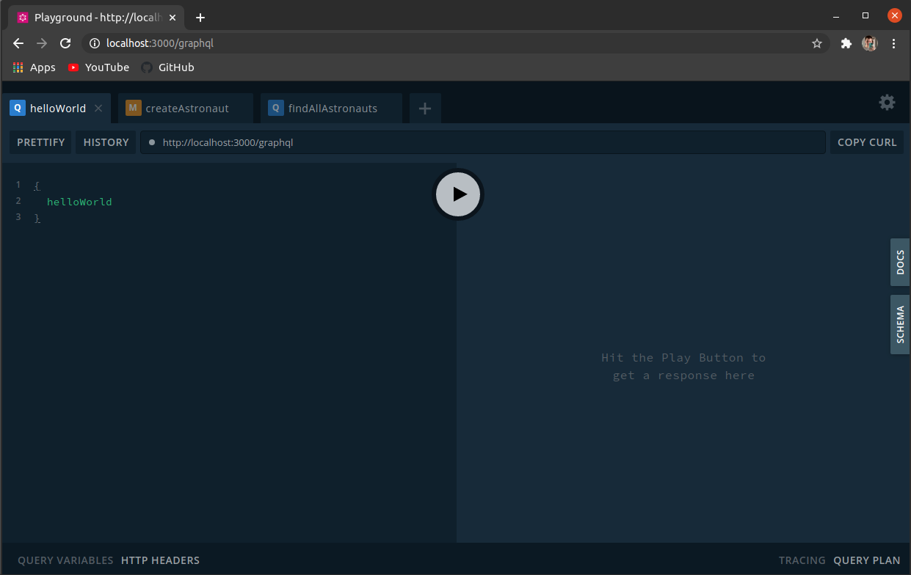

## About the repository:
Project to study the NestJs integration with GraphQL and MongoDB.

## Requirements:
- Nodejs
- npm
- MongoDB running locally

## Installation

```bash
$ npm install
```

## Running the app

```bash
# development
$ npm run start

# watch mode
$ npm run start:dev
```
## Examples:

On `http://localhost:3000/graphql` you will be able to see the GraphQL playground:


### Create Astronaut: 
```
mutation {
  createAstronaut(input: { name: "Lucas", surname: "Guiss", agency: "Spacex", age: 21}) {
  	id,
    name,
    surname,
    agency,
    age
  }
}
```

### Find All Astronauts:
```
{
  findAllAstronauts{
    id,
    name,
    surname,
    agency,
    age
  }
}
```

The output should be something like this:
```
{
  "data": {
    "findAllAstronauts": [
      {
        "id": "6032ac038af6b9202c916f72",
        "name": "Lucas",
        "surname": "Guiss",
        "agency": "spacex",
        "age": 21
      }
    ]
  }
}
```